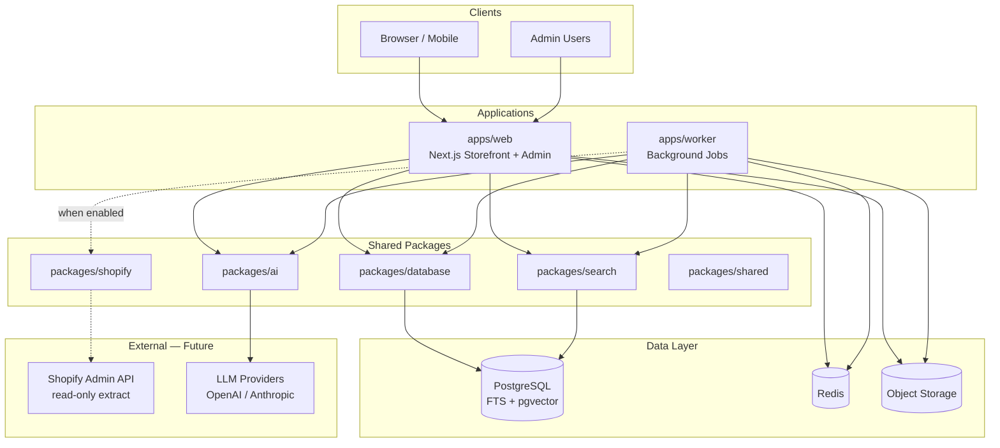

# Architecture

> **Status:** Proposed — awaiting approval before application implementation.

## Executive Summary

Sports Jersey House is a headless e-commerce platform built as a **pnpm + Turborepo monorepo**. It separates the customer-facing storefront, admin tooling, background workers, and AI services into distinct packages with clear boundaries. PostgreSQL is the system of record and the initial search engine through full-text search plus pgvector; Redis handles caching and job queues; S3-compatible storage serves media.

Shopify remains the **read-only source** during migration. No write-back. No live connectivity until explicitly enabled.

---

## Goals

| Goal | Approach |
|------|----------|
| Premium Apple-inspired UX | Next.js RSC, minimal UI, system typography, product-first layout |
| Extreme SEO | SSR/ISR, JSON-LD, sitemaps, AI-assisted metadata with human approval |
| AI throughout | Modular agents in `packages/ai`, async workers, graceful degradation |
| 8,876+ products | PostgreSQL full-text search + pgvector + CDN; paginated admin; batch workers |
| Scalable & production-ready | Typed monorepo, observability hooks, IaC-ready, horizontal worker scaling |
| Safe Shopify migration | Extract-only pipeline, validation gates, staged cutover |

---

## High-Level System Diagram



---

## Monorepo Structure

```
Sports-Jersey-House/
├── apps/
│   ├── web/                 # Next.js 15 — storefront + admin
│   └── worker/              # BullMQ job processor
├── packages/
│   ├── ai/                  # AI agent modules & prompt templates
│   ├── database/            # Drizzle schema, migrations, client
│   ├── search/              # PostgreSQL full-text search + pgvector abstraction
│   ├── shopify/             # Extraction client (dormant)
│   └── shared/              # Types, constants, Zod schemas
├── docs/
├── infrastructure/          # Terraform/Pulumi (future)
├── AGENTS.md
├── .env.example
└── turbo.json
```

### Why Monorepo?

- Shared types between storefront, workers, and AI agents eliminate drift.
- Turborepo caches builds across packages for fast CI.
- Clear package boundaries allow future extraction (e.g., separate worker fleet) without rewrite.

---

## Application Layer

### `apps/web` — Storefront & Admin

**Framework:** Next.js 15 (App Router)

| Route group | Purpose |
|-------------|---------|
| `(storefront)/` | Public pages: home, PLP, PDP, collections, search, cart, checkout |
| `(admin)/` | Catalogue management, AI review queue, SEO dashboard, settings |
| `api/` | REST/route handlers for cart, search, AI chat (streaming) |

**Rendering strategy:**

| Page type | Strategy | Revalidation |
|-----------|----------|--------------|
| Home, static pages | SSG | On publish |
| Product (PDP) | ISR | On product update webhook/job |
| Collection (PLP) | ISR | On collection update |
| Search results | SSR | Real-time via PostgreSQL search |
| Admin | SSR | Auth-gated, no cache |

**SEO features (built-in):**

- Dynamic metadata via `generateMetadata()`
- JSON-LD components per entity type
- Auto-generated `sitemap.xml` and `robots.txt`
- Canonical URLs, Open Graph, Twitter cards
- Image optimization via `next/image` + CDN

**Design system:**

- Tailwind CSS with design tokens (spacing, radius, color palette)
- Framer Motion for subtle transitions only
- Dark/light mode support (system preference default)

### `apps/worker` — Background Processing

Long-running and scheduled tasks:

| Job queue | Tasks |
|-----------|-------|
| `ai:product-seo` | Generate/enrich product SEO metadata |
| `ai:collection-seo` | Collection page copy and meta |
| `ai:tagging` | Taxonomy and attribute tagging |
| `ai:collection-assign` | Auto-assign products to collections |
| `ai:compliance` | Trademark/IP risk scan |
| `ai:technical-seo` | Site audit, broken links, schema check |
| `search:index` | Refresh PostgreSQL search vectors and ranking data |
| `search:embed` | Generate and store product embeddings in pgvector |
| `shopify:extract` | Pull catalog from Shopify (when enabled) |
| `media:process` | Image resize, WebP/AVIF variants |

Workers scale horizontally. Redis + BullMQ provides retries, dead-letter queues, and rate limiting.

---

## Data Architecture

### PostgreSQL (System of Record)

Core entities:

```
products ──┬── product_variants
           ├── product_images
           ├── product_tags
           ├── product_seo (human + AI fields)
           └── collection_products (M:N)

collections ── collection_seo

orders ── order_items ── (future)

ai_jobs ── ai_job_results
compliance_flags
redirects (SEO migration)
users / sessions (admin)
```

**Product lifecycle:**

```
draft → review → published → archived
         ↑
    AI generates content; human approves in admin
```

**Key indexes:** slug, SKU, status, updated_at, full-text on title/description (fallback if search is down).

### PostgreSQL Search (Initial Search & Discovery)

- Full-text product search with weighted `tsvector` columns for title, description, vendor, tags, team, league, and sport.
- Faceted filtering through normalized catalogue tables and indexed attributes such as sport, team, league, size, price, availability, and tags.
- Semantic search with product embeddings stored in pgvector.
- Hybrid retrieval through `packages/search`: full-text candidates + vector similarity + deterministic reranking.
- A provider interface keeps application callers independent from PostgreSQL internals so a dedicated search engine can be added later without rewriting storefront or AI callers.

### Redis

- Session store (admin auth)
- API rate limiting
- BullMQ job backend
- Hot cache for collection/product pages (optional L2)

### Object Storage (S3-compatible)

- Product images (original + variants: thumb, card, hero)
- AI-generated assets (future)
- Static exports (sitemap archives)

---

## AI Architecture

All AI logic lives in `packages/ai` with a provider-agnostic interface:

```typescript
// Conceptual — not implemented yet
interface AIAgent<TInput, TOutput> {
  name: string;
  run(input: TInput, ctx: AgentContext): Promise<AgentResult<TOutput>>;
}
```

### Agent Modules

| Module | Input | Output | Trigger |
|--------|-------|--------|---------|
| Shopping Assistant | User message + session context | Product recommendations, answers | Real-time (streaming) |
| Product SEO | Product data + images | Title, description, meta, JSON-LD draft | On create/update or batch |
| Collection SEO | Collection + top products | Page copy, meta, internal links | On create/update or batch |
| Technical SEO | Site crawl data | Issues, redirect suggestions | Scheduled |
| Catalogue Management | Bulk product set + instructions | Staged changes for review | Admin action |
| Product Tagging | Product attributes + images | Taxonomy tags, facets | On import or batch |
| Collection Assignment | Product + all collections | Suggested collections + confidence | On import or batch |
| Compliance | Product title/description/images | Risk flags, severity, notes | On publish attempt |
| Customer Service | Customer query + order context | Draft response, escalation | Real-time (future) |
| Merchandising | Sales/click data | Ranking adjustments | Scheduled (future) |
| Analytics | Event streams | Dashboards, insights | Scheduled (future) |

### AI Content Workflow

```
┌─────────┐    ┌──────────┐    ┌─────────┐    ┌───────────┐
│ Trigger │───▶│ AI Agent │───▶│ Review  │───▶│ Published │
│ (job)   │    │ (draft)  │    │ (admin) │    │ (live)    │
└─────────┘    └──────────┘    └─────────┘    └───────────┘
                                    │
                                    ▼
                              ┌──────────┐
                              │ Rejected │
                              │ (revise) │
                              └──────────┘
```

- AI never auto-publishes SEO or compliance-sensitive content.
- Compliance agent can **block** publish until resolved.

### Shopping Assistant

- Embedded chat widget on storefront (client) + streaming API route (server).
- RAG over product catalog: PostgreSQL full-text/vector retrieval + LLM synthesis.
- Session-scoped; no PII stored in prompts.
- Fallback: keyword search if LLM unavailable.

---

## Search Architecture

```
User query
    │
    ▼
┌─────────────────┐
│ Query parser    │  (intent, filters, entities)
└────────┬────────┘
         │
    ┌────┴────┐
    ▼         ▼
PostgreSQL   pgvector
full-text    similarity
    │         │
    └────┬────┘
         ▼
   Hybrid rerank
         │
         ▼
   Faceted results
```

For 8,876 products, PostgreSQL full-text search and pgvector are appropriate initial infrastructure. `packages/search` owns ranking, query parsing, filtering, and retrieval contracts so a dedicated search engine can be introduced later if catalog size or query load justifies it.

---

## Security & Compliance

- Admin: Auth.js with role-based access (viewer, editor, admin).
- All secrets via environment variables; `.env` never committed.
- Shopify credentials scoped to the read-only extraction app only. Temporary server-side tokens are obtained through Shopify's supported client-credentials authentication flow.
- Rate limiting on public API and AI endpoints.
- CSP headers, HTTPS-only, secure cookies.
- GDPR-ready: data export/delete hooks (future).

---

## Observability (Production)

| Concern | Tool (proposed) |
|---------|-----------------|
| Errors | Sentry |
| Logs | Structured JSON (pino) → log aggregator |
| Metrics | Prometheus-compatible / hosted APM |
| Uptime | External ping on `/api/health` |
| AI costs | Token usage logged per agent/job |

---

## Deployment Topology (Future — Not Deployed Yet)

```
                    ┌──────────────┐
                    │   CDN/WAF    │
                    └──────┬───────┘
                           │
              ┌────────────┴────────────┐
              │     apps/web (x N)      │
              │     Serverless or K8s   │
              └────────────┬────────────┘
                           │
     ┌─────────────────────┼─────────────────────┐
     │                     │
     ▼                     ▼
 PostgreSQL            Redis
 (managed)            (managed)
     │
     ▼
 Object Storage (CDN-backed)

 apps/worker (x M) ── same data layer
```

- **Web:** Vercel, AWS ECS, or similar — stateless, auto-scaling.
- **Worker:** Separate fleet; scales on queue depth.
- **Database:** Managed PostgreSQL (RDS, Neon, Supabase).
- **No deployment until architecture is approved and MVP is ready.**

---

## Performance Targets

| Metric | Target |
|--------|--------|
| PDP TTFB | < 200ms (cached ISR) |
| Search latency | < 100ms p95 |
| Lighthouse Performance | ≥ 90 |
| Lighthouse SEO | 100 |
| Catalog import | 8,876 products < 30 min (with AI batching) |

---

## Technology Choices — Rationale

| Choice | Why |
|--------|-----|
| Next.js 15 | Best-in-class SEO (RSC, ISR), React ecosystem, edge-ready |
| PostgreSQL | Relational integrity for commerce; JSONB for flexible attributes |
| Drizzle ORM | Type-safe, lightweight, great migration story |
| PostgreSQL FTS + pgvector | Strong initial search, fewer moving parts, semantic search support, and a clean path to a dedicated engine later |
| BullMQ | Mature Redis-backed queues; retries, priorities, rate limits |
| pnpm + Turborepo | Fast installs, cached builds, clean monorepo DX |
| Zod | Runtime validation at all boundaries |

---

## Out of Scope (Phase 0)

- Application code
- Shopify API connectivity
- Payment processing (Stripe integration — future phase)
- Order management / fulfillment
- Deployment and CI/CD pipelines
- Infrastructure provisioning

---

## Next Steps (After Approval)

1. Initialize monorepo tooling (`pnpm`, Turborepo, TypeScript configs).
2. Scaffold `apps/web` with Next.js, design tokens, and SEO primitives.
3. Define database schema in `packages/database`.
4. Implement PostgreSQL full-text search + pgvector abstraction in `packages/search`.
5. Build AI agent skeleton in `packages/ai` (interfaces + one reference agent).
6. Admin: product list, AI review queue.
7. Shopify extraction in `packages/shopify` (behind feature flag).
8. Staged migration dry-run with sample products.
