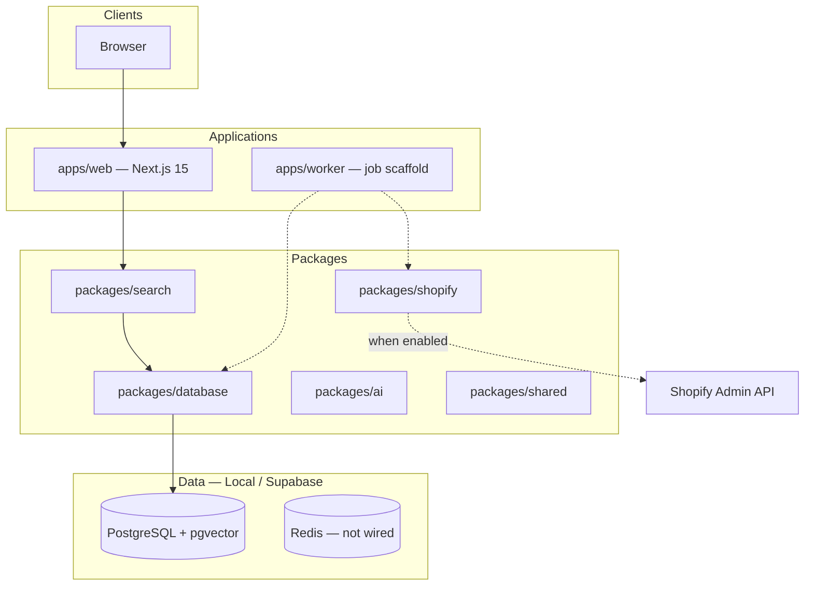

# Architecture

> **Status:** Phase 1 — Runnable foundation (implemented). This document reflects the **real** codebase, not a proposal.

## Executive Summary

Sports Jersey House is a headless e-commerce platform built as a **pnpm + Turborepo monorepo**. The customer-facing storefront and admin shell live in `apps/web`. Background processing is scaffolded in `apps/worker`. Shared packages provide database access, search, AI contracts, and a gated Shopify extraction client.

PostgreSQL (via Supabase in production, Docker locally) is the system of record and initial search engine (full-text + pgvector). Redis and BullMQ are dependencies for future workers. S3-compatible storage is planned for media.

Shopify (Sports Jersey Direct) remains **read-only** during migration. All API access is gated behind `ENABLE_SHOPIFY_SYNC=false` by default.

---

## System Diagram (Current)

---

## Monorepo Layout

| Path | Status | Purpose |
|------|--------|---------|
| `apps/web` | **Live** | Storefront, admin dashboard shell, SEO, health API |
| `apps/worker` | **Scaffold** | Queue names, job envelopes, CLI extract runner |
| `packages/database` | **Live** | Drizzle schema, 1 migration, seed, verify, checkpoints |
| `packages/search` | **Live** | Postgres FTS provider + empty fallback |
| `packages/shopify` | **Partial** | Client-credentials auth, product page extract + load |
| `packages/ai` | **Contracts** | Provider interface, disabled stub, brand brief |
| `packages/shared` | **Live** | Zod schemas, migration checkpoint types |

---

## Web Application (`apps/web`)

**Framework:** Next.js 15 App Router, React 19, plain CSS design tokens (no Tailwind yet).

### Implemented routes

| Route | Rendering | Notes |
|-------|-----------|-------|
| `/` | Static | Marketing homepage, brand brief from `@sjh/ai` |
| `/products` | `force-dynamic` | PLP with sport/league facets |
| `/products/[slug]` | `force-dynamic` | PDP + Product/Breadcrumb JSON-LD |
| `/collections` | `force-dynamic` | Collection index |
| `/collections/[slug]` | `force-dynamic` | Collection PLP |
| `/search` | `force-dynamic` | Full-text search |
| `/admin` | `force-dynamic` | Feature flags, catalogue stats, queue list (**no auth yet**) |
| `/api/health` | Dynamic | JSON health payload |
| `/sitemap.xml` | Dynamic | From published slugs |
| `/robots.txt` | Static config | Allows crawl, references sitemap |

### Design system (current)

CSS custom properties in `globals.css`: `--ink`, `--muted`, `--soft`, `--ember`, `--field`, `--gold`, `--radius`. Components: `BrandMark`, `ProductGrid`, `FacetNav`. Premium aesthetic with sticky blurred header and jersey-card hero — original SJH identity, not Apple copy.

### Data access pattern

Web does **not** import `@sjh/database` directly. All catalogue reads go through `packages/search` → `PostgresSearchProvider` or `EmptySearchProvider`.

---

## Database (`packages/database`)

### Migration: `0000_foundation.sql`

**Extensions:** `uuid-ossp`, `vector`

**Tables (11):** `products`, `product_variants`, `product_images`, `collections`, `collection_products`, `seo_records`, `compliance_flags`, `creative_assets`, `migration_runs`, `migration_checkpoints`

**Generated column:** `products.search_vector` (tsvector) exists in SQL only — not in Drizzle schema (see `docs/DECISIONS.md`).

**Dev seed:** 8 products, 4 collections (NFL, NBA, NHL, Soccer, MLB) via `pnpm db:seed`.

### Planned tables (not migrated yet)

`product_tags`, `orders`, `order_items`, `carts`, `customers`, `redirects`, `ai_jobs`, `users/sessions`

---

## Search (`packages/search`)

| Feature | Status |
|---------|--------|
| Provider abstraction (`SearchProvider`) | Done |
| PostgreSQL full-text search | Done |
| Facets (sport, league) | Done |
| Filters (team, price, availableOnly) | Done |
| pgvector / semantic | Column exists; no embedding jobs |
| Hybrid reranking | Not started |
| Pagination cursor | Type exists; not populated |

---

## Shopify (`packages/shopify`)

| Component | Status |
|-----------|--------|
| Client-credentials token exchange | Done |
| `ENABLE_SHOPIFY_SYNC` safety gate | Done |
| Paginated products GraphQL query | Done (variants + images) |
| Shopify → internal mapper | Done |
| Per-product upsert loader | Done |
| Resumable page extraction | Done |
| Collections / redirects extract | Not started |

Auth uses **only** `SHOPIFY_STORE_DOMAIN`, `SHOPIFY_CLIENT_ID`, `SHOPIFY_CLIENT_SECRET`. No permanent access token env var.

---

## AI (`packages/ai`)

Contracts only: `AiProvider`, `DisabledAiProvider`, `SeoAgent` interface, `createComplianceResult()`, `createInitialBrandBrief()`. No OpenAI/Anthropic providers, no prompt templates, no streaming chat API.

Feature flag `ENABLE_AI_SHOPPING_ASSISTANT` is parsed in web env and shown on admin page.

---

## Worker (`apps/worker`)

Queue names defined. CLI runner for one-page Shopify product extraction. BullMQ processor wiring is scaffolded but requires `REDIS_URL` to run continuously.

---

## Security (Current)

- Secrets via environment variables only
- Shopify credentials server-side only
- Admin routes **not authenticated** (known gap)
- No rate limiting on public routes yet

---

## Deployment Target

| Layer | Target |
|-------|--------|
| Web | Vercel |
| Database / Auth / Storage | Supabase |
| Workers | Vercel cron or separate Node process (TBD) |
| CDN | Vercel Edge / Supabase storage CDN |

Not deployed yet. See `docs/SETUP.md` for local development.

---

## Performance Notes

All catalogue pages use `force-dynamic` today (dev-friendly). ISR for PDP/PLP is planned once data is stable post-migration.

---

## Related Documents

- [ROADMAP.md](./ROADMAP.md) — phased delivery plan
- [SETUP.md](./SETUP.md) — local development
- [DECISIONS.md](./DECISIONS.md) — architecture decision log
- [migration-plan.md](./migration-plan.md) — Shopify cutover strategy
