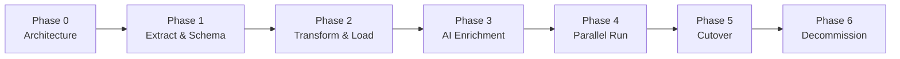

# Shopify Migration Plan

> **Status:** Planned — no Shopify API calls until explicitly approved and credentials are configured.

## Overview

Sports Jersey House currently operates on **Shopify**. This platform will replace the Shopify storefront. During migration, Shopify serves as a **read-only source** via the existing extraction app **"Sports Jersey House Extract"**.

**Principles:**

1. **Extract only** — never write back to Shopify.
2. **Validate before load** — every record passes schema and business-rule checks.
3. **Human review for AI content** — extracted data is enriched, not blindly published.
4. **Staged cutover** — parallel run, DNS switch, rollback plan.
5. **SEO preservation** — URL mapping, redirects, metadata continuity.

---

## Migration Phases



| Phase | Name | Status | Description |
|-------|------|--------|-------------|
| 0 | Architecture | **Complete** | Monorepo, docs, local infra, CI |
| 1 | Extract & Schema | **In progress** | Storefront catalogue live; Shopify extract pipeline ready (gated) |
| 2 | Transform & Load | Planned | ETL pipeline; load products, collections, media |
| 3 | AI Enrichment | Planned | SEO, tagging, collection assignment, compliance review |
| 4 | Parallel Run | Planned | New site on staging; compare with Shopify |
| 5 | Cutover | Planned | DNS, redirects, go-live |
| 6 | Decommission | Planned | Retire Shopify storefront (keep admin if needed temporarily) |

---

## Phase 1 — Extract & Schema Mapping

### Prerequisites

- [ ] Shopify credentials in `.env` (from "Sports Jersey House Extract" app): `SHOPIFY_STORE_DOMAIN`, `SHOPIFY_CLIENT_ID`, and `SHOPIFY_CLIENT_SECRET`
- [ ] `ENABLE_SHOPIFY_SYNC=true` explicitly set
- [ ] Architecture and database schema approved
- [ ] Stakeholder sign-off to begin API calls

### Shopify Entities to Extract

| Shopify Resource | Target Table(s) | Notes |
|------------------|-----------------|-------|
| Products | `products`, `product_variants`, `product_images` | ~8,876 products |
| Collections (custom + smart) | `collections`, `collection_products` | Preserve rules for smart collections |
| Product tags | `product_tags`, taxonomy mapping | AI re-tagging optional |
| Metafields | JSONB columns or dedicated tables | SEO, custom attributes |
| Redirects | `redirects` | Critical for SEO continuity |
| Pages / Blogs | `pages` (future) | If needed for content migration |
| Files / Media | Object storage | Download and re-host (never hotlink Shopify CDN long-term) |

### Extraction Strategy

```
packages/shopify/
├── auth/
│   └── client-credentials.ts # Temporary server-side token exchange
├── client.ts          # Admin API client (read-only scopes)
├── extractors/
│   ├── products.ts
│   ├── collections.ts
│   ├── redirects.ts
│   └── metafields.ts
├── mappers/
│   └── shopify-to-internal.ts
└── sync/
    ├── full-import.ts   # One-time bulk
    └── delta-sync.ts    # Incremental (webhook or polling — future)
```

**Rate limiting:** Respect Shopify Admin API limits (bucket/leaky). Use cursor-based pagination. Batch writes to PostgreSQL.

**Idempotency:** Each record keyed by `shopify_id` (stored, not exposed publicly). Re-runs upsert safely.

**Authentication:** Use only Shopify's supported client-credentials authentication flow with `SHOPIFY_STORE_DOMAIN`, `SHOPIFY_CLIENT_ID`, and `SHOPIFY_CLIENT_SECRET`. The extraction service obtains temporary tokens server-side as needed. Do not require or store a manually supplied permanent Shopify token.

---

## Phase 2 — Transform & Load

### ETL Pipeline

```
Shopify API
    │
    ▼
┌──────────────┐
│ Raw JSON     │  (optional staging table or S3 archive)
│ snapshot     │
└──────┬───────┘
       │
       ▼
┌──────────────┐
│ Transform    │  Map fields, normalize slugs, parse variants
└──────┬───────┘
       │
       ▼
┌──────────────┐
│ Validate     │  Zod schemas, required fields, slug uniqueness
└──────┬───────┘
       │
       ▼
┌──────────────┐
│ Load         │  PostgreSQL upsert (status: draft)
└──────┬───────┘
       │
       ▼
┌──────────────┐
│ Index        │  PostgreSQL search vectors + pgvector embeddings
└──────────────┘
```

### Data Quality Checks

- Every product has at least one variant, one image, a valid price.
- Slugs are unique and URL-safe.
- Smart collection rules translated to internal query definitions.
- Orphaned collection memberships flagged.
- Missing metafields logged, not silently dropped.

### Media Migration

1. Download original images from Shopify CDN during extract.
2. Upload to S3-compatible storage with structured paths: `/products/{id}/{variant}.webp`.
3. Generate responsive variants (thumb, card, hero) via worker job.
4. Update `product_images.url` to new CDN URLs.
5. Keep `shopify_cdn_url` temporarily for rollback comparison.

---

## Phase 3 — AI Enrichment

After raw load, background workers process the catalog:

| Job | Scope | Output |
|-----|-------|--------|
| Product SEO | All products | Draft titles, descriptions, meta, JSON-LD |
| Collection SEO | All collections | Draft page copy and meta |
| Product Tagging | All products | Taxonomy tags (sport, team, league, era) |
| Collection Assignment | Unassigned products | Suggested collection memberships |
| Compliance | All products | Trademark/IP risk flags |

**Workflow:** All AI output lands in `review` status. Admin team approves in batches before publish.

**Compliance gate:** Products with high-severity compliance flags cannot be published until resolved.

---

## Phase 4 — Parallel Run

### Staging Environment

- Full catalog loaded and AI-enriched (approved subset for soft launch if needed).
- Staging URL for internal QA and stakeholder review.
- Automated comparison reports:

| Check | Method |
|-------|--------|
| Product count | Shopify count vs PostgreSQL count |
| Price accuracy | Sample audit (100 random SKUs) |
| Image availability | HTTP 200 on all product images |
| URL coverage | Every Shopify product URL has redirect or matching slug |
| SEO metadata | Title/description present on all published products |
| Search quality | Top 50 queries return relevant results |

### Performance Testing

- Load test PDP and PLP at expected traffic.
- Search benchmark: 8,876 index, p95 < 100ms.
- Lighthouse audits on representative pages.

---

## Phase 5 — Cutover

### Pre-Cutover Checklist

- [ ] All published products approved in admin
- [ ] Compliance flags resolved or explicitly accepted
- [ ] Redirect map complete (Shopify URL → new URL)
- [ ] `sitemap.xml` submitted to Google Search Console
- [ ] SSL certificates provisioned
- [ ] Monitoring and alerting active
- [ ] Rollback plan documented and tested
- [ ] Customer communication prepared (if needed)

### URL Strategy

| Shopify pattern | New pattern | Action |
|-----------------|-------------|--------|
| `/products/{handle}` | `/products/{handle}` | Match where possible (301 if changed) |
| `/collections/{handle}` | `/collections/{handle}` | Match where possible |
| `/pages/{handle}` | `/pages/{handle}` | Match or redirect |
| Changed slugs | — | 301 redirect in `redirects` table |

### Cutover Steps

1. **Freeze** Shopify catalog changes (or enable delta sync).
2. **Final delta extract** — pull changes since last sync.
3. **Final AI review** — approve any changed content.
4. **DNS switch** — point domain to new platform.
5. **Enable redirects** — serve 301s for any changed URLs.
6. **Monitor** — errors, traffic, search rankings, conversion.
7. **Submit sitemap** — Google, Bing.

### Rollback Plan

- Keep Shopify storefront theme accessible (unpublished or password-protected).
- DNS TTL lowered to 300s before cutover for fast rollback.
- Rollback trigger: critical checkout failure, >5% 5xx error rate, or SEO emergency.
- Rollback action: revert DNS to Shopify; new platform goes to maintenance mode.

---

## Phase 6 — Decommission

After stable operation (recommended: 30–90 days):

- [ ] Confirm order flow fully on new platform (requires checkout migration — separate phase).
- [ ] Export final Shopify data archive for records.
- [ ] Remove Shopify theme / storefront (keep admin if orders still processed there).
- [ ] Revoke or rotate Shopify API credentials.
- [ ] Update `ENABLE_SHOPIFY_SYNC=false` — extraction no longer needed.

---

## Environment Variables (Shopify)

Configured in `.env.example` — **not populated yet:**

```bash
SHOPIFY_STORE_DOMAIN=       # e.g., your-store.myshopify.com
SHOPIFY_CLIENT_ID=          # From "Sports Jersey House Extract" app
SHOPIFY_CLIENT_SECRET=
ENABLE_SHOPIFY_SYNC=false   # Must be true to allow any API calls
```

The Shopify package must exchange the client ID and client secret for temporary server-side credentials using Shopify's supported client-credentials flow. Credentials and temporary tokens must never be exposed to the browser, committed to the repository, logged, or written into application source.
The Admin API version should be an internal package constant/configuration value, not a required environment variable.

### Required Shopify Scopes (Read-Only)

- `read_products`
- `read_product_listings`
- `read_collection_listings`
- `read_content` (pages, blogs — if migrating)
- `read_files` (media)
- `read_metaobjects` / metafields (as needed)

**No write scopes.** The extraction app must not be able to modify Shopify data.

---

## Risk Register

| Risk | Impact | Mitigation |
|------|--------|------------|
| SEO ranking drop | High | URL preservation, 301 redirects, sitemap, GSC monitoring |
| Data loss during extract | High | Raw JSON snapshots archived before transform |
| API rate limiting | Medium | Cursor pagination, exponential backoff, off-peak batching |
| Image broken links | Medium | Re-host all media; verify with automated crawl |
| Trademark/compliance issues | High | AI compliance agent + human review before publish |
| Smart collection mismatch | Medium | Translate rules; validate membership counts vs Shopify |
| Extended parallel run cost | Low | Time-box Phase 4; define go/no-go criteria |

---

## Timeline Estimate (Indicative)

| Phase | Duration | Dependencies |
|-------|----------|--------------|
| 0 — Architecture | 1 week | Approval |
| 1 — Extract & Schema | 1–2 weeks | Credentials, schema |
| 2 — Transform & Load | 1–2 weeks | Phase 1 |
| 3 — AI Enrichment | 2–3 weeks | Phase 2, AI agents |
| 4 — Parallel Run | 2–4 weeks | Phase 3, staging deploy |
| 5 — Cutover | 1 day (+ monitoring) | Phase 4 sign-off |
| 6 — Decommission | 30–90 days post-cutover | Stable operation |

*Timeline assumes checkout/payments migration is a separate workstream.*

---

## Open Decisions (Require Stakeholder Input)

1. **Checkout:** Migrate to Stripe/custom checkout, or keep Shopify checkout temporarily?
2. **URL changes:** Any intentional slug changes, or strict 1:1 preservation?
3. **Smart collections:** Replicate Shopify rules exactly, or simplify taxonomy?
4. **Content locales:** Single locale now, or multi-language from start?
5. **Order history:** Migrate historical orders, or new platform = new orders only?
6. **Shopify admin:** Retain for fulfillment after storefront cutover?

---

## What We Are NOT Doing Now

- No Shopify API calls
- No credential configuration
- No data extraction or import
- No DNS or deployment changes

These begin only after architecture approval and Phase 1 prerequisites are met.
